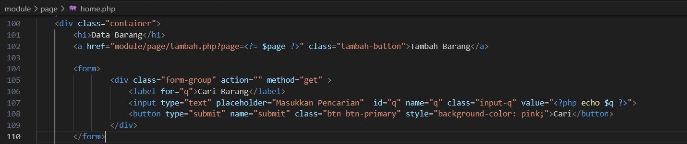
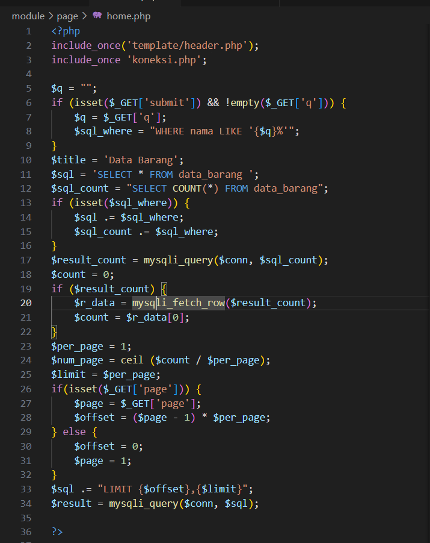
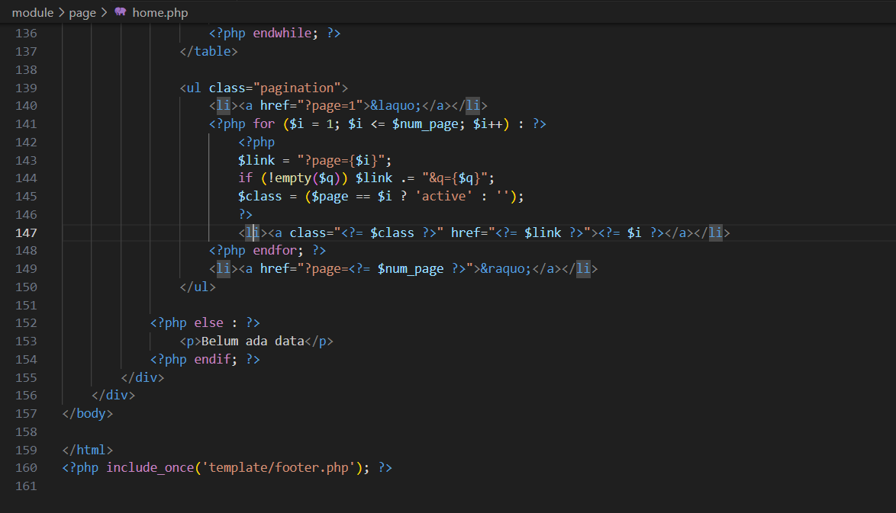
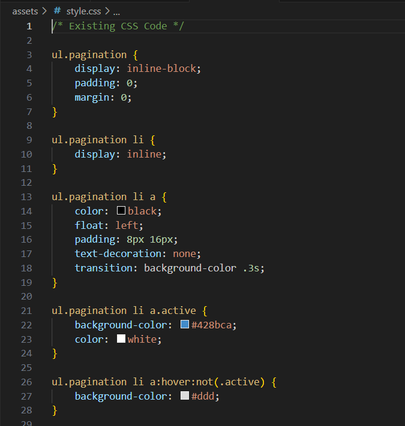

# Membuat Pencarian Data dan Membuat Pagination
## Pencarian Data

Untuk membuat pencarian data, yang perlu di perhatikan adalah penggunaan filter pada query data. Pada data awal, query untuk menampilkan semua data adalah:
```
$sql = “SELECT * FROM data_barang”;

```
Nah untuk menambahkan pencarian, maka query tersebut harus ditambahkan klausa WHERE sebagai filter, sehingga menjadi:
```
$sql = “SELECT * FROM data_barang WHERE nama = ‘{$var_nama}’”;
```

Atau dapat juga menggunakan LIKE seperti berikut:
```
$sql = “SELECT * FROM data_barang WHERE nama LIKE ‘{$var_nama}%’”;
```

Langkah selanjutnya adalah membuat form pencarian.

```
<form>
    <div class="form-group" action="" method="get" >
        <label for="q">Cari Barang</label>
        <input type="text" placeholder="Masukkan Pencarian"  id="q" name="q" class="input-q" value="<?php echo $q ?>">
        <button type="submit" name="submit" class="btn btn-primary" style="background-color: pink;">Cari</button>
    </div>
</form>
```


Sisipkan kode tersebut pada file index.php (daftar barang), sebelum table data dan sesudah tombol tambah data.
Lalu rubah querynya dan tambahkan filter pencarian pada query tersebut.
```
include_once 'koneksi.php';

$q = "";
if (isset($_GET['submit']) && !empty($_GET['q'])) {
    $q = $_GET['q'];
    $sql_where = "WHERE nama LIKE '{$q}%'"; 
}
$title = 'Data Barang';
$sql = 'SELECT * FROM data_barang ';
$sql_count = "SELECT COUNT(*) FROM data_barang";
if (isset($sql_where)) {
    $sql .= $sql_where;
    $sql_count .= $sql_where;
}
$result_count = mysqli_query($conn, $sql_count);
$count = 0;
if ($result_count) {
    $r_data = mysqli_fetch_row($result_count);
    $count = $r_data[0];
}
$per_page = 1;
$num_page = ceil ($count / $per_page);
$limit = $per_page;
if(isset($_GET['page'])) {
    $page = $_GET['page'];
    $offset = ($page - 1) * $per_page;
} else {
    $offset = 0;
    $page = 1;
}
$sql .= "LIMIT {$offset},{$limit}";
$result = mysqli_query($conn, $sql);

?>
```


## Membuat Pagination
Pagination digunakan untuk membatasi atau membagi record data yang akan ditampilkan pada laman web. Dari seluruh record data yang ada akan dibagi berdasarkan jumlah record per-halaman.

Pada prinsipnya untuk membatasi tampilan record data pada query mysql menggunakan LIMIT dan OFFSET;

Query alwal:
```
$sql = “SELECT * FROM tabel_barang”;
```

Untuk menapilkan data dari record ke 1 sampai record ke 10:
```
$sql = “SELECT * FROM table_barang LIMIT 10”;
```

Untuk menampilkan data dari receord ke 11 sampai dengan record ke 20, disini digunakan OFFSET:
```
$sql = “SELECT * FROM table_barang LIMIT 10,20”;```

Untuk membagi jumlah halaman, tentu kita harus ketahui dulu jumlam record secara keseluruhan, selanjutnya di bagi dengan jumlah record per halaman, maka akan diketahui jumlah halamannya.

Untuk mengetahui jumlah record secara keseluruhan:
```
$sql = “SELECT COUNT(*) FROM table_barang”;

```
Misal resultnya adalah 30 record, akan ditampilkan perhalaman sejumlah 10 record, maka:
```
$page = $row_count / $per_page; ==> 3 = 30/10```

Maka akan dihasilkan 3 halaman, sehingga paging dibuat menjadi tiga tombol (1, 2, 3).

## Membuat File: index.php
Lakukan perubahan code mulai baris 10:
```
include_once 'koneksi.php';

$q = "";
if (isset($_GET['submit']) && !empty($_GET['q'])) {
    $q = $_GET['q'];
    $sql_where = "WHERE nama LIKE '{$q}%'"; 
}
$title = 'Data Barang';
$sql = 'SELECT * FROM data_barang ';
$sql_count = "SELECT COUNT(*) FROM data_barang";
if (isset($sql_where)) {
    $sql .= $sql_where;
    $sql_count .= $sql_where;
}
$result_count = mysqli_query($conn, $sql_count);
$count = 0;
if ($result_count) {
    $r_data = mysqli_fetch_row($result_count);
    $count = $r_data[0];
}
$per_page = 1;
$num_page = ceil ($count / $per_page);
$limit = $per_page;
if(isset($_GET['page'])) {
    $page = $_GET['page'];
    $offset = ($page - 1) * $per_page;
} else {
    $offset = 0;
    $page = 1;
}
$sql .= "LIMIT {$offset},{$limit}";
$result = mysqli_query($conn, $sql);

?>
```


Selanjutnya tambahkan code berikut setelah tabel data:

```
 <?php endwhile; ?>
                </table>

                <ul class="pagination">
                    <li><a href="?page=1">&laquo;</a></li>
                    <?php for ($i = 1; $i <= $num_page; $i++) : ?>
                        <?php
                        $link = "?page={$i}";
                        if (!empty($q)) $link .= "&q={$q}";
                        $class = ($page == $i ? 'active' : '');
                        ?>
                        <li><a class="<?= $class ?>" href="<?= $link ?>"><?= $i ?></a></li>
                    <?php endfor; ?>
                    <li><a href="?page=<?= $num_page ?>">&raquo;</a></li>
                </ul>

            <?php else : ?>
                <p>Belum ada data</p>
            <?php endif; ?>
        </div>
    </div>
</body>

</html>
<?php include_once('template/footer.php'); ?>
```



## Kemudian tambahkan style CSS untuk pagination nya:
```
ul.pagination {
    display: inline-block;
    padding: 0;
    margin: 0;
}

ul.pagination li {
    display: inline;
}

ul.pagination li a {
    color: black;
    float: left;
    padding: 8px 16px;
    text-decoration: none;
    transition: background-color .3s;
}

ul.pagination li a.active {
    background-color: #428bca;
    color: white;
}

ul.pagination li a:hover:not(.active) {
    background-color: #ddd;
}
```




